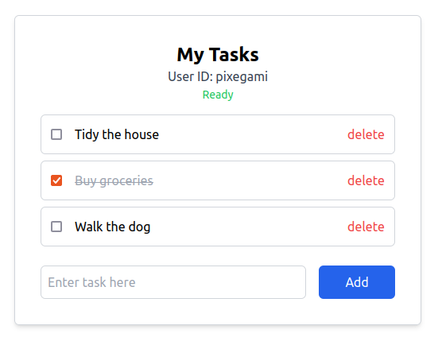

# To-do List API: A FastAPI CRUD App

This project is a full-stack CRUD app (a todo-list) with a Python FastAPI backend and a
NextJS frontend. It is hosted on serverless AWS infrastructure (using Lambda and DynamoDB).



## API Folder

The `/api` folder contains the Python FastAPI code.

## Infrastructure Folder

The `/todo-infra` folder contains the CDK code to deploy all the infrastructure
(Lambda function and DynamoDB table) to your AWS account.

You must have [AWS CLI](https://aws.amazon.com/cli/) configured, and
[AWS CDK](https://docs.aws.amazon.com/cdk/v2/guide/home.html) installed on your machine.

First, install the node modules.

```bash
npm install
```

Then run bootstrap if you never used CDK with your account before.

```bash
cdk bootstrap
```

Before you can deploy you need to build the front-end folder. Go into the `todo-site` folder and
build the NextJS app.

```bash
npm run build
```

Then go back to the `todo-infra` folder and deploy the stack. The site won't work yet because you'll need to get your API endpoint and update the front-end code too (see below).

```bash
cdk deploy
```

## Frontend Folder

The `/todo-site` contains the NextJS frontend that interfaces with the CRUD API. If you want to
test it with your endpoint, then don't forget to change `todoApiEndpoint` and `userId` to your own
API (in `pages/index.tsx`).

First, go into the `index.tsx` file and update the API route to the one you generated by your CDK deploy.

```typescript
// TODO: Update this URL to your own API endpoint!
const todoApiEndpoint: string =
  "https://XXXXXXX.lambda-url.ap-southeast-2.on.aws";
```

Install the node modules.

```bash
npm install
```

Run the development server locally.

```bash
npm run dev
```

Build and export.

```bash
npm run build
```

This will create static site assets to the `/out` folder in the front-end folder.

## Test Folder

This contains the Pytest integration tests you can use to test your endpoint directly. Don't
forget to change your `ENDPOINT` to the one you want to use (in `api_integration_test.py`).

You can run the test like this (but you have to have `pytest` installed):

```bash
pytest
```
